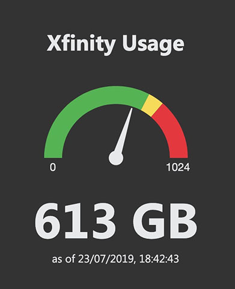

# xfinity-usage-tracker
This tool tracks your Xfinity usage and:

 - Can notify you if your are using more than you should during the month
 - Update a Google Spreadsheet that gives you an overview of your monthly usage

## Requirements

 - Python3
 - Chromedriver ([http://chromedriver.chromium.org/](http://chromedriver.chromium.org/))
 - xfinity-usage ([https://github.com/jantman/xfinity-usage](https://github.com/jantman/xfinity-usage))
 - oauth2client ([https://github.com/googleapis/oauth2client](https://github.com/googleapis/oauth2client))
 - gspread ([https://github.com/burnash/gspread](https://github.com/burnash/gspread))

jantman is the original author of xfinity-usage but xfinity-usage-tracker uses a slightly modified version: [https://github.com/nbonamy/xfinity-usage](https://github.com/nbonamy/xfinity-usage).

Python dependencies can be installed using

    pip install -r requirements.txt

Chromedriver must be installed manually and available in your PATH.

## Setup
The script requires a number of configuration values to be defined. You can define them as environment variables or in a JSON configuration file. It should be named `config.json` and placed in the same folder as the script. You can use `config-sample.json` as as starting point. Some of the configuration variables can be specified from the command line. Run with `--help` to learn about it.

Configuration variables are loaded in the following order of priority:

 - Command line arguments
 - Environment variables
 - Configuration file

### Xfinity data collection
Xfinity data collection requires two variables:

 - `XFINITY_USER`: your Xfinity username
 - `XFINITY_PASS`: your Xfinity account password

As Comcast takes some time to reflect your latest usage, you can choose to offset the timestamp of the usage collected. For instance, if you think Comcast numbers reflect your usage 4 hours ago, you can offset this using `XFINITY_OFFSET` with a value of `-4`. So for instance, if you run the script at 3 am with this setting, the usage from the day before will be updated (3 am minus four hours is 11 pm from the previous day).

### Mail alert
The script can alert you if your data usage is above a certain threshold of what it should be. For instance, if your data cap is 1024 GB, and today is half month, you should have used no more than 512 GB. The script can alert you if you used more than 90% (can be changed) of those 512 GB so far.

Configuration values are:

 - `XFINITY_SMTP_HOST`: Hostname of your SMTP server
 - `XFINITY_SMTP_PORT`: Port of your SMTP server
 - `XFINITY_SMTP_USER`: Username to authenticate on your SMTP server
 - `XFINITY_SMTP_PASS`: Password to authenticate on your SMTP server
 - `XFINITY_EMAIL_FROM`: Email of the sender of the message
 - `XFINITY_EMAIL_TO`: Email of the recipient of the message
 - `XFINITY_WARNING`: Change the warning threshold. Default value is 0.9. Set it to 0 to always send a mail.

If you use a gmail account, you can only setup `XFINITY_SMTP_USER` and `XFINITY_SMTP_PASS`. All other parameters will be set automatically. It is recommended to generate an App Password ([https://myaccount.google.com/apppasswords](https://myaccount.google.com/apppasswords)).

### Tracking spreadsheet

To automatically update the tracking spreadsheet, first make a copy of the [template spreadsheet](https://docs.google.com/spreadsheets/d/1qOlky2kmSPPd09E3s1AzVnfBIbZUpi5MOuvAiip2MWs) in your Google Drive.

You then need then to enable API access to this copy. Please follow the instructions here: [https://www.twilio.com/blog/2017/02/an-easy-way-to-read-and-write-to-a-google-spreadsheet-in-python.html](https://www.twilio.com/blog/2017/02/an-easy-way-to-read-and-write-to-a-google-spreadsheet-in-python.html). Save the JSON credentials as `client_secret.json` in the same folder as the script. Do not forget to share the spreadsheet with the email address specified in `client_secret.json` (`client_email` key).

Once this is done, you need to define the following configuration:

 - `XFINITY_GSHEET`: id of your Google spreadsheet. You can extract that from the URL displayed by your browser when you view the file. If the URL is `https://docs.google.com/spreadsheets/d/abcd8673ef/edit#gid=0` then the ID is `abcd8673ef`.

## Scheduling
You can use your favorite scheduler (cron or Windows Task Scheduler) to automatically launch the script. If you want to track usage for each calendar day, then at least schedule it to run at 11.55pm (although there is some delay in Comcast update of your usage). It is recommended to run it only once a day: if you decide to run it more often, please check the disclaimer on [https://github.com/jantman/xfinity-usage](https://github.com/jantman/xfinity-usage): it is also valid for xfinity-usage-tracker.

## Behind a webserver
Configuring your favorite webserver (Apache or Nginx) is not documented here. You need to run the script as a CGI script.
As the process can take some time, a waiting page (`index.html`) is provided.

You can also quickly check your usage by accessing `usage.html`. This page should display fine on your phone!

## Logging
When run from the command line, you can force logging to a file with the `--log` option. When run as a CGI script, logging to file is always enabled.

